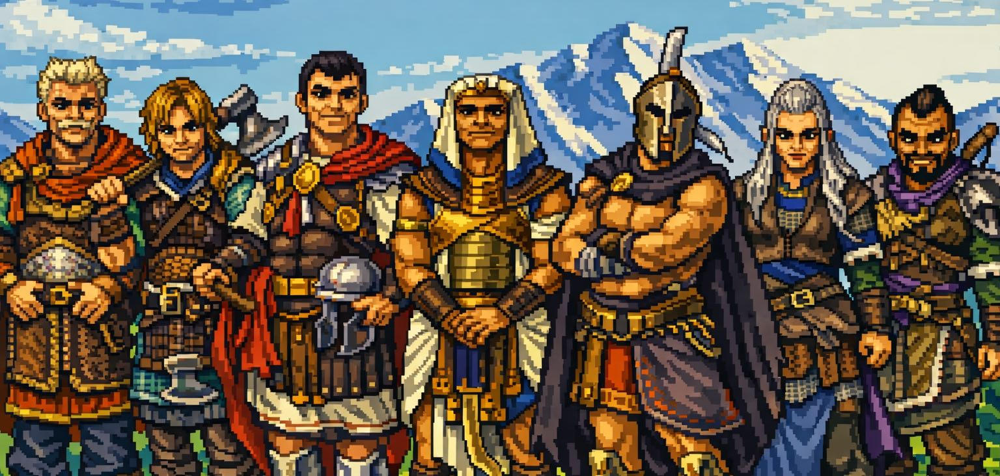
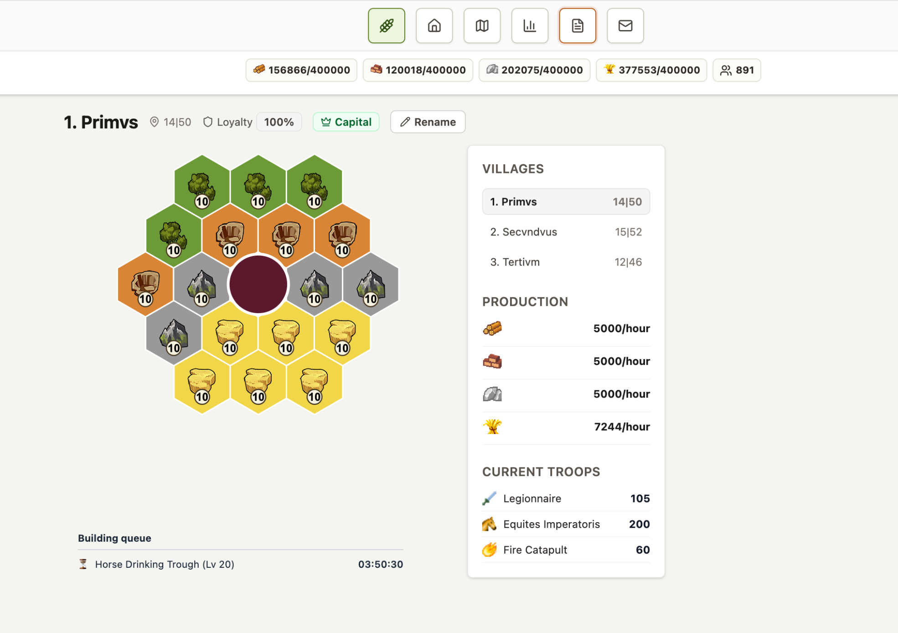
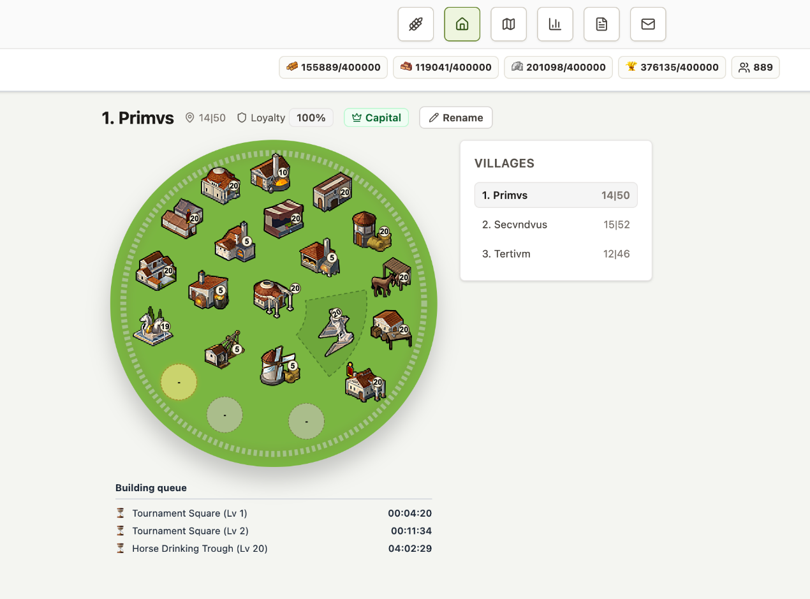
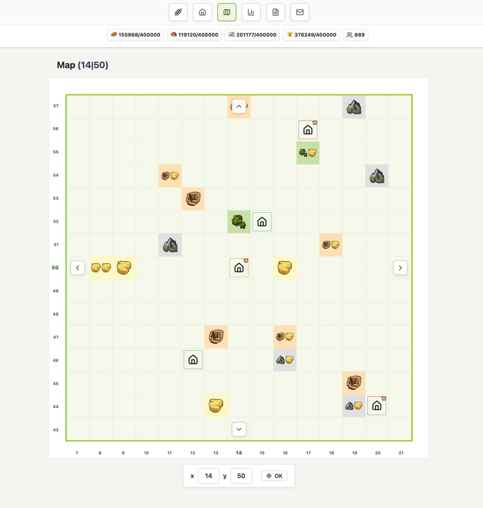

# Parabellum




[](https://github.com/andreapavoni/parabellum/actions/workflows/ci.yml)


Parabellum es un intento de crear (¡otro más!) un MMORPG moderno, rápido y de código abierto inspirado en el clásico juego Travian 3.x.

Este proyecto está destinado a quienes aman la estrategia profunda y la comunidad del original, pero buscan una alternativa construida sobre una pila tecnológica moderna. El objetivo es crear un servidor ligero, fácil de desplegar y completamente libre de mecánicas de "pagar para ganar".

El proyecto aún se encuentra en sus etapas iniciales, pero los cimientos se están consolidando día a día. Ahora está en un punto donde las contribuciones son muy bienvenidas para ayudar a dar forma al juego.

[DEMO JUGABLE](https://parabellum.funky.studio)

**¡ATENCIÓN!** Parabellum está en desarrollo activo y es **mayormente jugable**. Muchas mecánicas centrales ya están implementadas, otras están por venir. Es posible registrarse y tener una experiencia _decente_ hasta fundar o conquistar una nueva aldea, pero **aún no está completo ni cuenta con todas las funciones, estamos trabajando en ello**. Consulta la hoja de ruta y el estado a continuación.

---

## Objetivos del Proyecto

* **Experiencia Central de Travian**: Replicar el 80-90% principal de las mecánicas del juego (construcción, gestión de recursos, tropas, ataques, alianzas).
* **Rápido, Robusto y Ligero**: Usar Rust para crear un servidor de alto rendimiento que cualquiera pueda ejecutar. El código incluye pruebas unitarias e integración para garantizar que todo funcione como se espera.
* **Sin "Pay-to-Win"**: Esto es innegociable. Este proyecto nace por el amor al juego, no por monetización predatoria.
* **Stack Moderno**: Saltarse intencionalmente características obsoletas como foros o chats en el juego, asumiendo que los jugadores usarán herramientas modernas como Discord.
* **Código Abierto**: Crear un proyecto impulsado por la comunidad que pueda ser bifurcado, modificado y utilizado como referencia.

---

## Inicio Rápido

¿Quieres ejecutar el servidor localmente? Aquí te explicamos cómo.

**Requisitos previos:**
* Rust (>= 1.85)
* Postgres 16.x
* Bun 1.x
* (opcional, pero mucho más fácil para desplegar) Docker & Docker Compose
* `sqlx-cli` (ejecuta `cargo install sqlx-cli --no-default-features --features postgres`)

**Pasos:**

1.  **Clona el repositorio:**
    ```sh
    git clone https://github.com/andreapavoni/parabellum.git
    cd parabellum
    ```

2.  **Configura el entorno:**
    ```sh
    # Copia el archivo .env de ejemplo
    cp .env.sample .env
    ```
    (No deberías necesitar modificarlo para desarrollo local).

3.  **Inicia la base de datos:**
    ```sh
    docker-compose up -d db
    ```

4.  **Crea las bases de datos:**
    ```sh
    # Esto configura las bases de datos de desarrollo Y prueba
    ./setup_db.sh
    ```

5.  **(opcional) Carga datos iniciales del juego:**
    ```sh
    # Usa seed/default.json por defecto
    cargo run -p parabellum_server --bin parabellum-seed
    ```
    También puedes pasar un archivo de datos personalizado:
    ```sh
    cargo run -p parabellum_server --bin parabellum-seed -- seed/game.json
    ```
    El cargador soporta múltiples jugadores y múltiples aldeas por jugador. Estructura raíz JSON:
    ```json
    {
      "players": [
        {
          "username": "andrea",
          "email": "andrea@example.com",
          "password": "andrea",
          "tribe": "Roman",
          "villages": [
            {
              "template": "developed",
              "quadrant": "NorthEast",
              "buildings": [
                { "slotId": 39, "name": "RallyPoint", "level": 2 }
              ]
            }
          ]
        }
      ]
    }
    ```
    Usa archivos de plantilla separados para mantener configuraciones de aldea reutilizables, por ejemplo:
    - `seed/default.json` (jugadores + referencias de aldea)
    - `seed/templates/developed.json` (configuración por defecto de aldea)
    - `seed/templates/rusher.json` (otro perfil de aldea)

    Los archivos de plantilla se cargan desde `seed/templates/<template>.json` y se fusionan con las sobreescripciones de la aldea (`upsert` basado en `slotId` para `buildings`.
    La primera aldea sigue las reglas de registro: siempre se funda en un valle aleatorio desocupado en el `quadrant` seleccionado (no se permite `position` explícita para la primera aldea).
    Las aldeas adicionales pueden establecer una `position` explícita (debe estar libre) o usar la selección aleatoria de valle desocupado con `quadrant`.
    Si se omite, los valores por defecto de inicio de sesión se mantienen deterministas: el correo es `<username>@example.com`, la contraseña es `<username>`.

6.  **Instala las dependencias del frontend:**
    ```sh
    bun install
    ```

7. **(opcional) Ejecuta la aplicación en docker:**
   ```sh
   docker-compose up -d app
   ```

8.  **(opcional) Ejecuta las pruebas:**
    ```sh
    cargo test --release --
    ```

9.  **Ejecuta el servidor:**
    ```sh
    cargo run --release
    ```

  A partir de ahora, puedes ir a `http://localhost:8000` y ver el progreso.

El frontend ahora es una SPA `Preact + Vite` servida por la aplicación Rust, respaldada por endpoints JSON bajo `/api/v1`. Cargo compila el paquete del frontend automáticamente a través de `parabellum_web/build.rs`; para verificación independiente del frontend también puedes ejecutar:

```sh
bun run build:release
```

### Reproducción de Eventos (Modelos de Lectura)

Parabellum persiste eventos del juego y proyecta modelos de lectura a partir de esos eventos.

- **Reproducción en seco (dry-run)**: inspecciona flujos de eventos y ventanas de reproducción sin mutar modelos de lectura.
- **Reproducción completa**: aplica eventos y reconstruye modelos de lectura para el objetivo seleccionado.

```sh
# por defecto: --target all --mode dry-run --from 1
cargo run -p parabellum_server --bin parabellum-replay

# reproducción completa solo para proyecciones de aldea
cargo run -p parabellum_server --bin parabellum-replay -- --target village --mode full

# ventana acotada
cargo run -p parabellum_server --bin parabellum-replay -- --from 1000 --to 2000
```

El punto de entrada de reproducción es proporcionado por el runtime del servidor y está destinado a tareas de mantenimiento/operaciones en entornos de desarrollo o controlados.

### Backfill de Héroes

Las bases de datos más antiguas creadas antes de la asignación automática de héroes pueden tener jugadores sin héroes. Usa el comando de backfill para agregar los eventos `HeroCreated` faltantes a través del flujo normal basado en eventos.

```sh
# dry-run: lista jugadores que recibirían un héroe
cargo run -p parabellum_server --bin parabellum-backfill-heroes

# ejecutar: crea un héroe de nivel 0 para cada jugador que le falte
cargo run -p parabellum_server --bin parabellum-backfill-heroes -- --execute
```

---

## Capturas de Pantalla





---

## Ejecuta tu propio servidor (experimental)

Hay una imagen en DockerHub, simplemente usa: `andreapavoni/parabellum:latest`. Puedes usar [docker-compose-prod.yml](docker-compose-prod.yml) como punto de partida. Luego ejecútalo:

```sh
docker-compose -f docker-compose-prod.yml up -d
```

## Hoja de Ruta de Características

Aquí hay un seguimiento de alto nivel de lo que funciona, lo que está en progreso y lo que aún falta por hacer.

### Implementado
- [x] **Arquitectura Central**: Una estructura de aplicación limpia basada en comandos.
- [x] **Base de datos**: Persistencia en Postgres con adaptadores SQLx.
- [x] **Acciones Programadas**: Flujo de programación y finalización impulsado por eventos.
- [x] **Datos del Juego**: Todos los datos estáticos para edificios, unidades, tribus y mejoras de herrería están definidos.
- [x] **Jugador**: Registro de jugadores.
- [x] **Aldea**: Fundación inicial de aldeas.
- [x] **Recursos**: Generación pasiva de recursos (el "tick") basada en los niveles de edificios y la velocidad del servidor.
- [x] **Población**: Cálculo de población.
- [x] **Edificios**: Ciclo completo de comandos y trabajos para iniciar y completar la construcción.
- [x] **Entrenamiento de Unidades**: Ciclo completo de comandos y trabajos para entrenar una cola de unidades. Solo cuartel por el momento.
- [x] **Investigación**: Ciclo completo de comandos y trabajos para investigación en Academia y Herrería.
- [x] **Batalla**: Lógica central de batalla (cálculo atacante vs. defensor) implementada.
- [x] **Ciclo de Ataque**: Cadena completa de trabajos "Ataque" -> "Batalla" -> "Retorno del Ejército".
- [x] **Características de Batalla**: Cálculo de daño de ariete/catapulta y botín de recursos.
- [x] **Comerciantes**: Ofertas en el mercado, envío de recursos entre aldeas.
- [x] **Velocidad del Servidor**: Soporte completo para diferentes velocidades que influyen en tiempos, stocks y capacidades de comerciantes.
- [x] **Mejoras/Retrocesos de Edificios**: Mejorar/retroceder edificios, considerando también los niveles del edificio principal y la velocidad del servidor.
- [x] **Refuerzos**: Envío de tropas para apoyar otras aldeas.
- [x] **Reconocimiento**: Tipo de ataque "Explorador" (la lógica existe, pero no hay comando/trabajo).
- [x] **Entrenamiento de Unidades**: soporte para todos los tipos de unidades en sus edificios relacionados.
- [x] **Héroes**: Existe el modelo de héroe y la lógica básica de bonificaciones, pero aún no están integrados en ejércitos o batallas.
- [x] **Usuarios y Autenticación**: Login/registro/logout, necesita recuperación de contraseña
- [x] **Bootstrap del Mapa Mundial**: Bootstrap automático del mapa del juego en la primera ejecución.
- [x] **Expansión de Colonos**: Entrenamiento de colonos, seguimiento de puntos de cultura, fundación de nuevas aldeas.
- [x] **Expansión de Jefes**: Cálculo de batalla para lealtad y conquista

### En Progreso
**API / UI**: Obteniendo las vistas mínimas viables para navegar el juego:
- [x] Layout, barra de navegación básica
- [x] Login, Registro
- [x] Vista General de la Aldea (Recursos + Edificios)
  - [x] Cola de construcción
- [x] Edificio genérico (info + añadir/mejorar)
- [x] Tabla de clasificación básica
- [x] Página de perfil de jugador básica
- [ ] Edificios especiales (info + acciones específicas)
  - [x] Entrenamiento de unidades: Cuartel, Establo, Taller, etc...
  - [x] Punto de Reunión:
    - [x] enviar tropas
    - [x] ver movimientos de tropas (ataques/raides/refuerzos/retornos de ejército en curso/entrantes)
    - [x] ver refuerzos en propia y otras aldeas
    - [x] liberar/recordar refuerzos desde/en otras aldeas
  - [x] Informes
    - [x] movimientos de tropas (ataque, raide, exploración, refuerzo)
    - [x] mercado
  - [x] Academia (investigar unidades)
  - [x] Herrería (mejorar unidades)
  - [x] Comerciante, Mercado
    - [x] Enviar recursos a una aldea
    - [x] Vender/comprar recursos
  - [ ] **Héroes**:
    - [x] Integración completa en batallas e informes
    - [x] Ciclo de vida: integración completa con el ciclo de vida del héroe
    - [ ] Conquista de oasis
  - [x] Palacio/Residencia (entrenar colonos, slots de expansión, puntos de cultura)
  - [ ] Ayuntamiento (fiesta pequeña/grande)
  - [x] Edificio Principal (retrocesos de construcción)
  - [x] Romana: Bebida Equina
  - [x] Galos: Trampas: Construir y aplicar ciclo de vida de trampas
- [x] Mapa

### Por Hacer (Sin Iniciar)
- [ ] **Sistema i18n**: soporte i18n nativo (refactorizar)
- [ ] **Editar Perfil de Jugador**: tener un perfil básico para mostrar
- [ ] **Mensajes**
  - [ ] Jugador-Jugador
  - [ ] Alianza-Jugador
- [ ] **Oasis**:
  - [ ] Captura y gestión de oasis (los modelos existen, la lógica no).
  - [ ] Bonificación de recursos al conquistarlos.
  - [ ] Producción de recursos y aparición de ejércitos de Naturaleza en oasis libres.
- [ ] **Alianzas**: Crear y gestionar alianzas.
- [ ] **Recuperación de Contraseña**: usando email? Cambiar a OAuth?
- [ ] **Fin del Juego**: Maravilla del Mundo, Natas, etc.
- [ ] **UI de Administrador**: un panel minimalista para gestionar el juego.
- [ ] **Ayuda/Manual**: para aprender.
- [ ] **Más i18n**: agregar traducciones para diferentes idiomas.

---

## Estructura del Proyecto

El proyecto está estructurado como un workspace de Cargo con varios crates distintos:

* `parabellum_server`: El ejecutable binario principal. Este es el punto de entrada que une todo.
  - Los puntos de entrada binarios están en `parabellum_server/bin/`:
    - `parabellum` (runtime del servidor)
    - `parabellum-seed` (herramienta de carga inicial)
    - `parabellum-replay` (herramienta de reproducción de eventos)

### Infraestructura
Estos paquetes proporcionan las herramientas necesarias para que el sistema funcione. Ofrecen persistencia de datos, interfaces de comunicación y pueden modificarse o agregarse de forma independiente.

* `parabellum_web`: La capa de entrega web. Sirve la API JSON, endpoints de autenticación con token portador (`/api/v1/auth/token/*` + `/api/v1/auth/refresh`) y el shell/activos de la SPA.
* `parabellum_infra`: La capa de base de datos. Proporciona la implementación concreta de los repositorios de base de datos (usando `sqlx` y Postgres).

### Dominio
Estos paquetes definen todo el motor del juego. No contienen detalles de infraestructura (como base de datos, servidor http, etc.). En su lugar, contienen datos estáticos (unidades, costos, tiempos), reglas del juego, validaciones, etc.

* `parabellum_app`: La capa de aplicación. Es el "cerebro" del proyecto. Define comandos, consultas y puertos que orquestan los casos de uso del juego.
* `parabellum_game`: La capa de dominio central. Este crate *no sabe nada* sobre bases de datos o servidores web. Contiene las reglas puras del juego, modelos (Aldea, Ejército, Edificio) y lógica (por ejemplo, `battle.rs`).
* `parabellum_types`: Estructuras de datos simples compartidas que son utilizadas por todos los demás crates para evitar dependencias circulares.

## Documentación para Desarrolladores

- Visión general de la arquitectura de backend: [`docs/ARCHITECTURE.md`](docs/ARCHITECTURE.md)
- Visión general de la arquitectura de frontend: [`docs/FRONTEND_ARCHITECTURE.md`](docs/ARCHITECTURE.md)
- Matriz de contrato de API: [`docs/api-contract-matrix.md`](docs/api-contract-matrix.md)
- Convenciones de pruebas y errores: [`docs/TESTING_AND_ERROR_CONVENTIONS.md`](docs/TESTING_AND_ERROR_CONVENTIONS.md)

---

## Cómo Contribuir

¡Las contribuciones son muy bienvenidas! Dado que el proyecto está en etapas iniciales, las cosas aún son muy flexibles.

1.  **Encuentra algo en qué trabajar**:
    * Revisa la lista de `Por Hacer` en la hoja de ruta anterior.
    * Elige un elemento `En Progreso` y ayuda a terminarlo.
    * Encuentra un error o un cálculo faltante.
    * Ayuda a mejorar la documentación o agrega más pruebas.
2.  **Ponte en contacto**:
    * Por ahora, la mejor forma es **abrir un Issue** en GitHub.
    * Describe en qué te gustaría trabajar o el error que encontraste.
    * Podemos discutir el mejor enfoque allí antes de que empieces a programar.
3.  **Envía un Pull Request**:
    * Crea un PR con tus cambios y ¡lo revisaremos juntos!

No te preocupes por "hacerlo mal". ¡Lo más importante es involucrarte!

---

## Créditos

Este proyecto no sería posible sin el increíble trabajo realizado por el [proyecto TravianZ](https://github.com/Shadowss/TravianZ) y [el trabajo de Kirilloid](https://github.com/kirilloid/travian) en detallar las mecánicas del juego.

## Licencia

Parabellum es software de código abierto licenciado bajo la **Licencia MIT**.


## Derechos de Autor

Un trabajo conjunto de [pavonz](https://pavonz.com). (c) 2023-2026.
